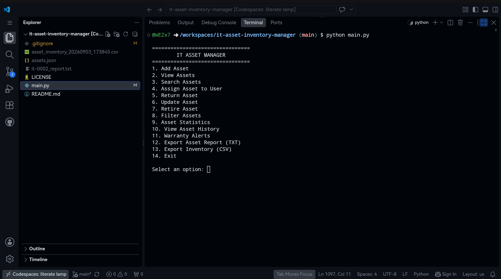
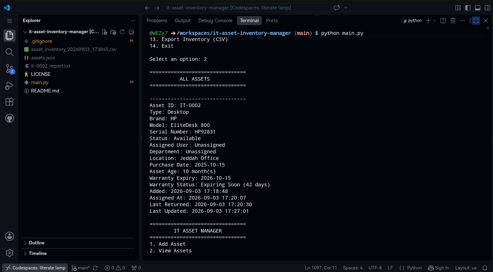
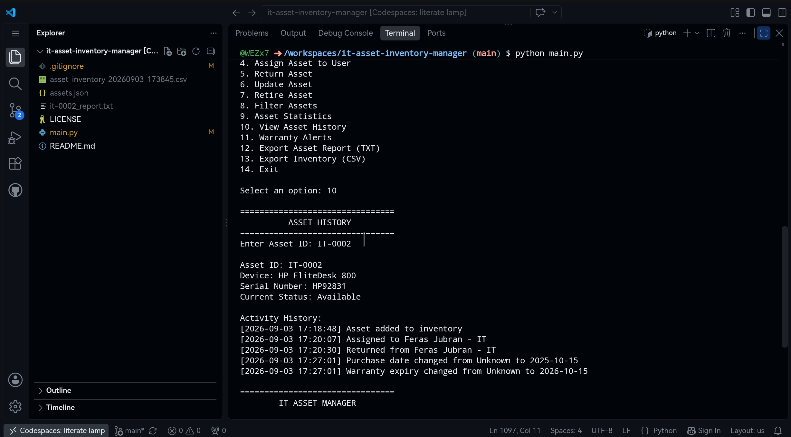
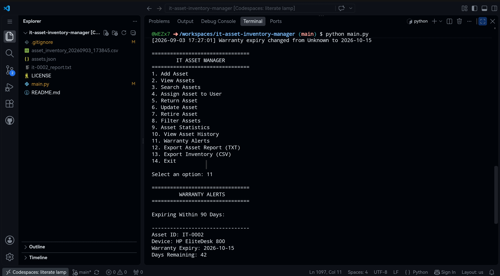

# IT Asset Inventory Manager

A Python-based command-line IT asset management system for tracking computers, hardware, users, device assignments, warranty information, asset history, and inventory reports.

The project simulates common IT asset management workflows used by IT support teams to maintain hardware inventory and track devices throughout their lifecycle.

## Features

### Asset Management

- Add new IT assets
- Automatic asset IDs
- View all assets
- Update asset information
- Retire assets
- Persistent local storage using JSON
- Duplicate serial number detection
- Creation and update timestamps

Example asset:

```text
Asset ID: IT-0002
Type: Desktop
Brand: HP
Model: EliteDesk 800
Serial Number: HP92831
Status: Available
Assigned User: Unassigned
Department: Unassigned
Location: Jeddah Office
```

### Asset Assignment

Assets can be assigned to users and departments.

Example:

```text
Asset: IT-0002
Device: HP EliteDesk 800
Current Status: Available

Assign to user: Feras Jubran
Department: IT

Asset IT-0002 assigned to Feras Jubran successfully.
```

Assigned assets automatically change their status to:

```text
In Use
```

### Asset Return

Assigned devices can be returned to inventory.

When an asset is returned:

- Status changes to Available
- Assigned user is cleared
- Department is cleared
- Return time is recorded
- Activity history is updated

### Asset Retirement

Assets that are no longer in service can be retired.

Retirement:

- Changes asset status to Retired
- Records the retirement date
- Records a retirement reason
- Prevents the device from being assigned again
- Adds the action to the asset history

Assets currently assigned to a user must be returned before they can be retired.

### Search

Assets can be searched using information such as:

- Asset ID
- Serial number
- Brand
- Model
- Asset type
- User
- Department
- Location
- Status

### Filtering

Assets can be filtered by:

- Status
- Asset type
- Department
- Location

Supported asset statuses:

```text
Available
In Use
Retired
```

### Asset Statistics

The system includes an inventory statistics dashboard.

Statistics include:

- Total assets
- Available assets
- In-use assets
- Retired assets
- Assigned assets
- Unassigned assets
- Asset types
- Departments
- Locations
- Warranty statistics
- Active asset rate
- Asset utilization rate

Example:

```text
ASSET STATISTICS

Total Assets: 5

Status:
Available: 2
In Use: 2
Retired: 1

Assignment:
Assigned Assets: 2
Unassigned Assets: 3

Warranty:
Active: 2
Expiring Soon: 1
Expired: 1
Unknown: 1

Active Asset Rate: 80.0%
Asset Utilization Rate: 40.0%
```

## Asset History / Audit Log

Each asset includes an activity history that records important lifecycle events.

Tracked actions include:

- Asset creation
- Technician or user assignment
- Asset return
- Hardware information changes
- Location changes
- Purchase date changes
- Warranty changes
- Asset retirement

Example:

```text
ASSET HISTORY

Asset ID: IT-0002
Device: HP EliteDesk 800

Activity History:
[2026-09-03 17:18:48] Asset added to inventory
[2026-09-03 17:20:07] Assigned to Feras Jubran - IT
[2026-09-03 17:20:30] Returned from Feras Jubran - IT
[2026-09-03 17:27:01] Purchase date changed from Unknown to 2025-10-15
[2026-09-03 17:27:01] Warranty expiry changed from Unknown to 2026-10-15
```

## Purchase and Warranty Tracking

Assets can store:

- Purchase date
- Warranty expiration date
- Asset age
- Warranty status

Example:

```text
Purchase Date: 2025-10-15
Asset Age: 10 month(s)
Warranty Expiry: 2026-10-15
Warranty Status: Expiring Soon (42 days)
```

Possible warranty states include:

```text
Active
Expiring Soon
Expires Today
Expired
Unknown
```

### Warranty Alerts

The application can automatically identify active assets with warranties that:

- Have already expired
- Expire within the next 90 days

Example:

```text
WARRANTY ALERTS

Expiring Within 90 Days:

Asset ID: IT-0002
Device: HP EliteDesk 800
Warranty Expiry: 2026-10-15
Days Remaining: 42
```

Retired assets are excluded from warranty alerts.

## TXT Asset Reports

Individual assets can be exported to a detailed text report.

Example file:

```text
it-0002_report.txt
```

The report includes:

- Asset ID
- Hardware information
- Serial number
- Status
- Assigned user
- Department
- Location
- Purchase date
- Asset age
- Warranty information
- Created and updated timestamps
- Assignment and return timestamps
- Retirement information
- Complete activity history
- Report generation time

Example:

```text
IT ASSET REPORT
================================

Asset ID: IT-0002
Type: Desktop
Brand: HP
Model: EliteDesk 800
Serial Number: HP92831
Status: Available
Location: Jeddah Office
Purchase Date: 2025-10-15
Asset Age: 10 month(s)
Warranty Expiry: 2026-10-15
Warranty Status: Expiring Soon (42 days)

ACTIVITY HISTORY
================================
[2026-09-03 17:18:48] Asset added to inventory
[2026-09-03 17:20:07] Assigned to Feras Jubran - IT
[2026-09-03 17:20:30] Returned from Feras Jubran - IT
```

## CSV Inventory Export

The complete inventory can be exported to CSV for use with spreadsheet software such as Microsoft Excel or Google Sheets.

Example file:

```text
asset_inventory_20260903_173845.csv
```

Exported information includes:

- Asset ID
- Type
- Brand
- Model
- Serial number
- Status
- Assigned user
- Department
- Location
- Purchase date
- Asset age
- Warranty expiration
- Warranty status
- Created time
- Last updated time
- Assignment time
- Return time
- Retirement time
- Activity history count

## Main Menu

```text
================================
        IT ASSET MANAGER
================================
1. Add Asset
2. View Assets
3. Search Assets
4. Assign Asset to User
5. Return Asset
6. Update Asset
7. Retire Asset
8. Filter Assets
9. Asset Statistics
10. View Asset History
11. Warranty Alerts
12. Export Asset Report (TXT)
13. Export Inventory (CSV)
14. Exit
```

## Project Structure

```text
it-asset-inventory-manager/
│
├── main.py
├── README.md
├── LICENSE
└── .gitignore
```

The application also creates local files while running:

```text
assets.json
it-0002_report.txt
asset_inventory_YYYYMMDD_HHMMSS.csv
```

These generated files should not be committed to the repository.

Recommended `.gitignore` entries:

```text
assets.json
it-*_report.txt
asset_inventory_*.csv
__pycache__/
*.pyc
```

## Requirements

- Python 3
- No external packages required

The project uses Python standard-library modules including:

- `json`
- `csv`
- `os`
- `datetime`

## How to Run

Clone the repository:

```bash
git clone https://github.com/WEZx7/it-asset-inventory-manager.git
```

Navigate to the project directory:

```bash
cd it-asset-inventory-manager
```

Run the application:

```bash
python main.py
```

Depending on your operating system, you may need:

```bash
python3 main.py
```

## Example Workflow

A typical IT asset workflow might look like this:

```text
1. Add a new laptop or desktop to inventory
2. Record purchase and warranty information
3. Assign the device to an employee
4. Track the employee's department and location
5. Search or filter inventory when needed
6. Return the device when the employee no longer requires it
7. Review the asset activity history
8. Monitor warranty expiration
9. Retire the asset at the end of its lifecycle
10. Export inventory data for reporting
```

## Screenshots

### Main Menu



### Asset Details



### Asset History



### Warranty Alerts



## Project Purpose

This project was created to practice Python programming while simulating practical IT asset management and IT support workflows.

It demonstrates experience with:

- IT asset management
- Hardware inventory tracking
- Device lifecycle management
- End-user device assignment
- Asset auditing
- Warranty tracking
- Hardware documentation
- Inventory reporting
- JSON data persistence
- CSV data export
- TXT report generation
- Search and filtering
- Python functions and data structures
- Input validation
- File handling
- Error handling

## Future Improvements

Possible future improvements include:

- SQLite database
- Graphical user interface
- User authentication
- Role-based access control
- QR code asset labels
- Barcode scanning
- Asset maintenance records
- Automated warranty notifications
- Supplier and vendor tracking
- Purchase cost tracking
- Dashboard charts
- Web-based version

## License

This project is licensed under the MIT License.

## Author

Feras M. Jubran
